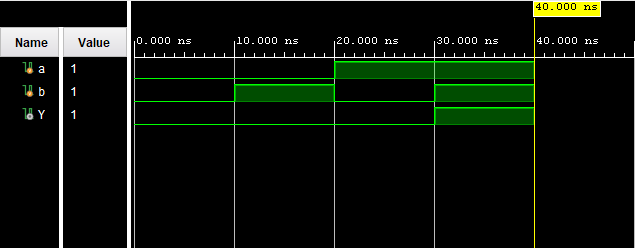
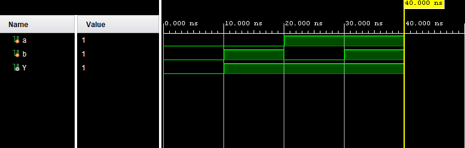
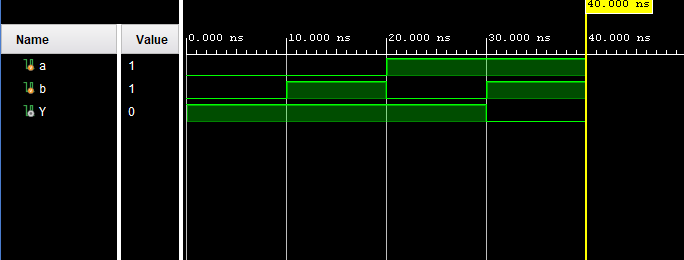
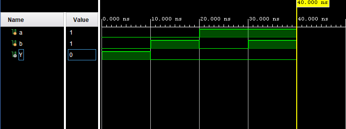
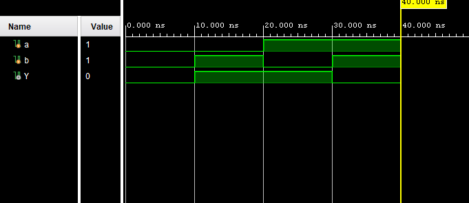
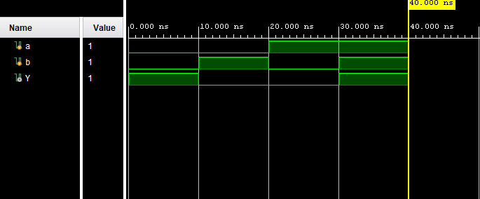
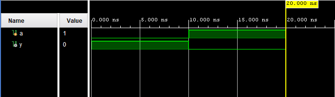

# Logic Gates using Vivado

This repository contains Verilog HDL implementations, testbenches, truth tables, and simulation waveforms for basic digital logic gates using Xilinx Vivado.

---

# AND Gate

## Description
The AND gate produces HIGH output only when all inputs are HIGH.

## Truth Table

| A | B | Y |
|---|---|---|
| 0 | 0 | 0 |
| 0 | 1 | 0 |
| 1 | 0 | 0 |
| 1 | 1 | 1 |

## Waveform

---

# OR Gate

## Description
The OR gate produces HIGH output when at least one input is HIGH.

## Truth Table

| A | B | Y |
|---|---|---|
| 0 | 0 | 0 |
| 0 | 1 | 1 |
| 1 | 0 | 1 |
| 1 | 1 | 1 |

## Waveform

---

# NAND Gate

## Description
The NAND gate is the inverse of the AND gate. It produces LOW output only when all inputs are HIGH.

## Truth Table

| A | B | Y |
|---|---|---|
| 0 | 0 | 1 |
| 0 | 1 | 1 |
| 1 | 0 | 1 |
| 1 | 1 | 0 |

## Waveform

---

# NOR Gate

## Description
The NOR gate is the inverse of the OR gate. It produces HIGH output only when all inputs are LOW.

## Truth Table

| A | B | Y |
|---|---|---|
| 0 | 0 | 1 |
| 0 | 1 | 0 |
| 1 | 0 | 0 |
| 1 | 1 | 0 |

## Waveform

---

# XOR Gate

## Description
The XOR gate produces HIGH output when the inputs are different.

## Truth Table

| A | B | Y |
|---|---|---|
| 0 | 0 | 0 |
| 0 | 1 | 1 |
| 1 | 0 | 1 |
| 1 | 1 | 0 |

## Waveform

---

# XNOR Gate

## Description
The XNOR gate produces HIGH output when both inputs are the same.

## Truth Table

| A | B | Y |
|---|---|---|
| 0 | 0 | 1 |
| 0 | 1 | 0 |
| 1 | 0 | 0 |
| 1 | 1 | 1 |

## Waveform

---

# NOT Gate

## Description
The NOT gate inverts the input signal.

## Truth Table

| A | Y |
|---|---|
| 0 | 1 |
| 1 | 0 |

## Waveform

---

# Tools Used

- Verilog HDL
- Xilinx Vivado
